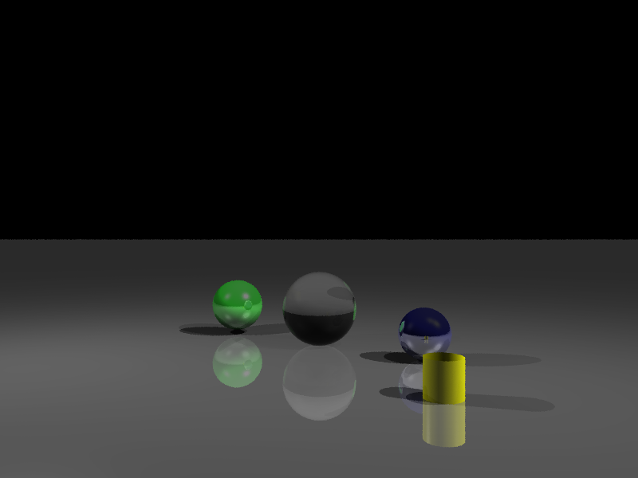

# RayTracer

RayTracer is a powerful and efficient ray tracing engine written in C++. It simulates the path of light to generate realistic images, supporting features like Phong shading, specular highlights, and configurable scenes.



## ✨ Features

- **Primitives**: Renders basic shapes including Spheres, Planes, and Rectangles.
- **Lighting**: Phong shading model with ambient, diffuse, and specular components.
- **Point & Directional Lights**: Multiple light source types with attenuation.
- **Configuration**: `libconfig`-based scene configuration for easy setup.

## 🚀 Getting Started

Follow these instructions to get a copy of the project up and running on your local machine for development and testing purposes.

### Prerequisites

- **CMake**: v3.14 or higher
- **C++ Compiler**: GCC, Clang, or MSVC supporting C++17
- **Git**: To clone the repository

### Installation

1.  **Clone the repository:**
    ```bash
    git clone https://github.com/your-username/raytracer.git
    cd raytracer
    ```

2.  **Configure the project:**
    ```bash
    cmake -S . -B build
    ```
    *CMake will automatically fetch and build dependencies (SFML, libconfig).*

3.  **Build the executable:**
    ```bash
    cmake --build build --config Release
    ```

### Running

Once built, you can run the raytracer from the build directory.

**On Linux/macOS:**
```bash
./build/raytracer scenes/example.cfg
```

**On Windows:**
```powershell
.\build\Release\raytracer.exe scenes\example.cfg
```

### Configuration

Scenes are defined in configuration files (usually in the `scenes/` directory). Refer to `scenes/example.cfg` to understand the format.

## 🛠️ Built With

- [C++17](https://en.cppreference.com/w/cpp/17) - The core programming language.
- [SFML](https://www.sfml-dev.org/) - For window management and image display.
- [libconfig](https://hyperrealm.github.io/libconfig/) - For parsing configuration files.
- [CMake](https://cmake.org/) - Build system.

